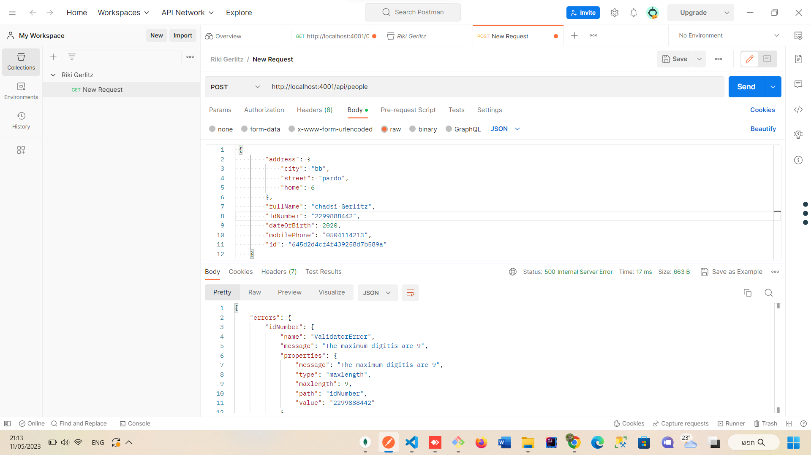
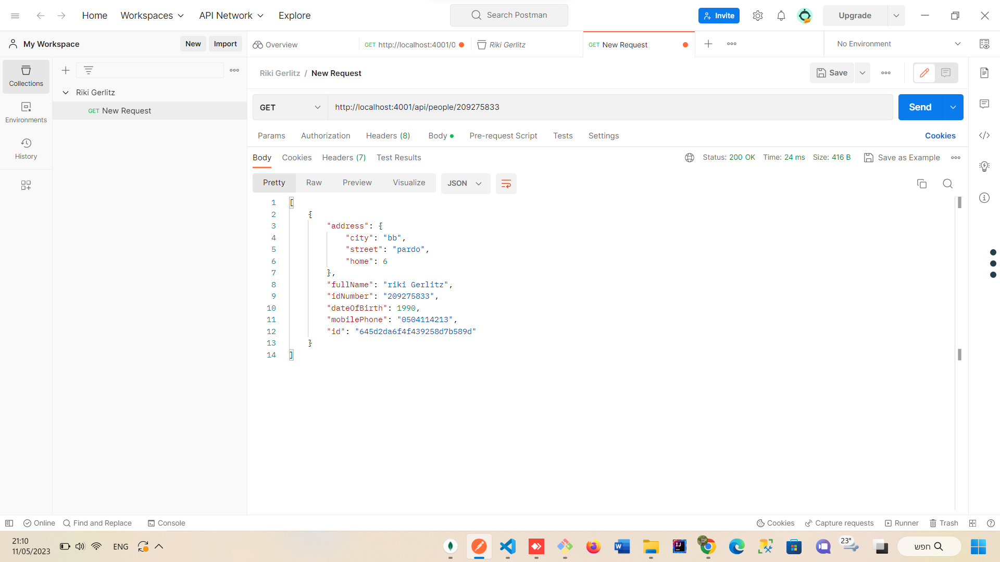
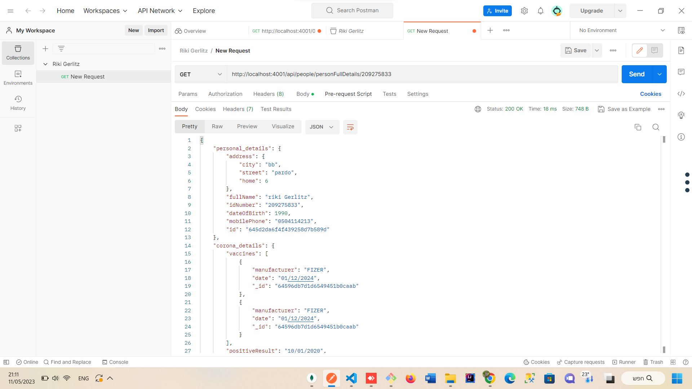
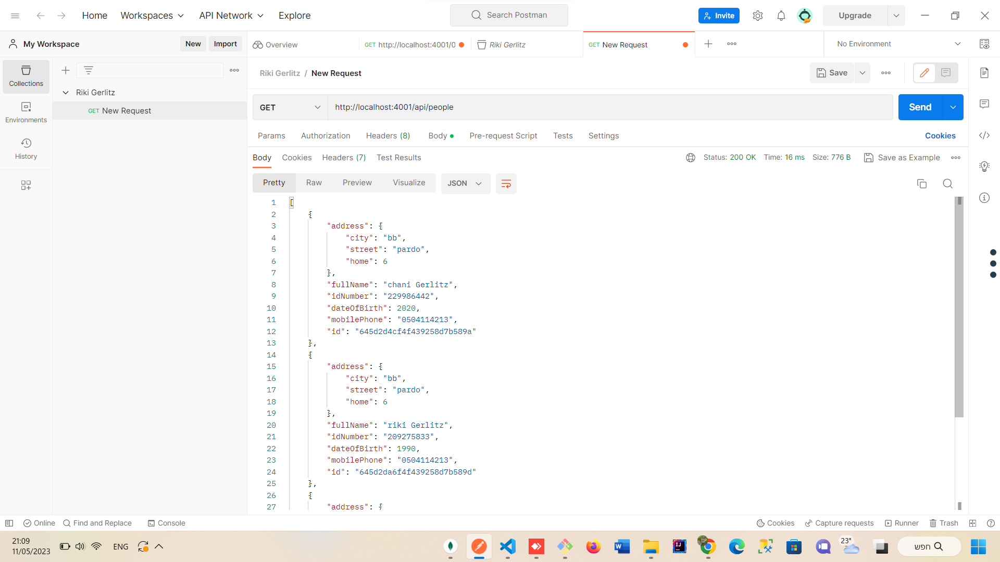
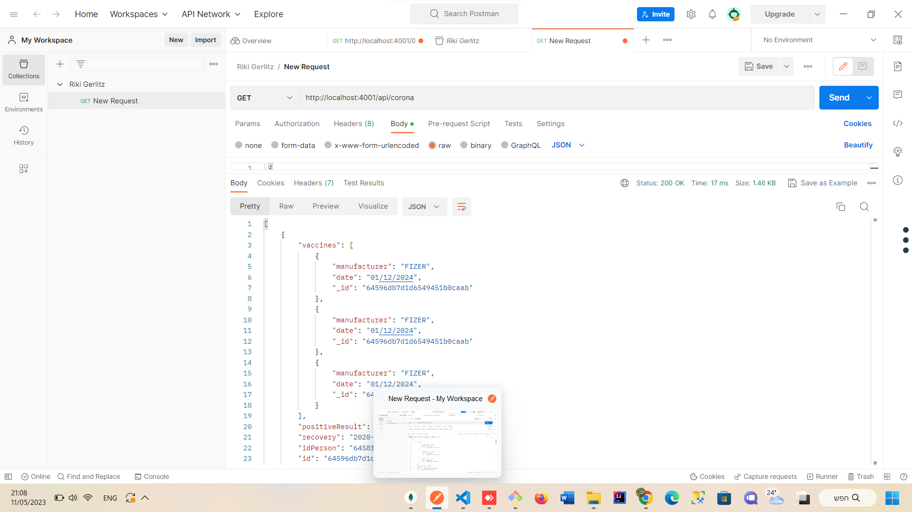
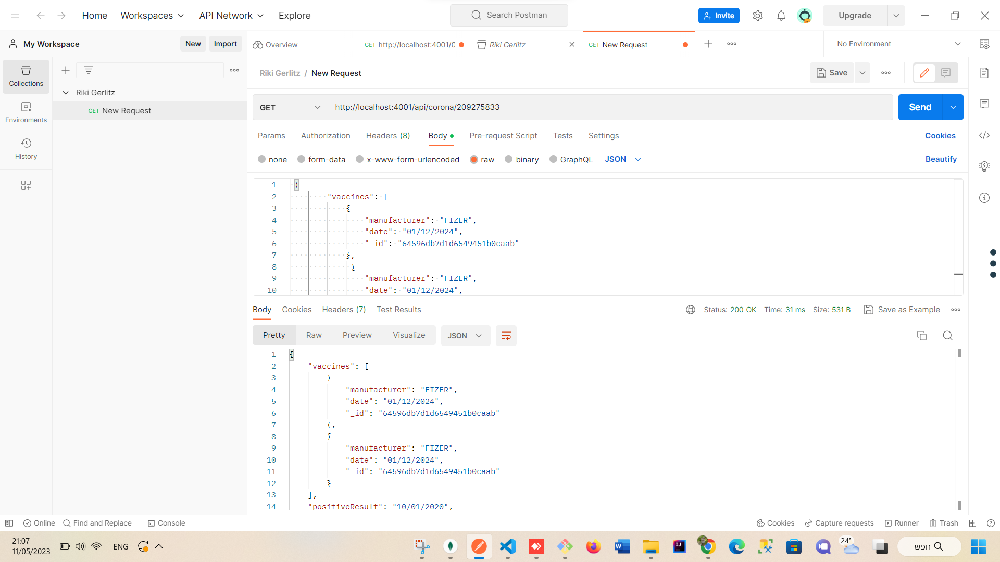
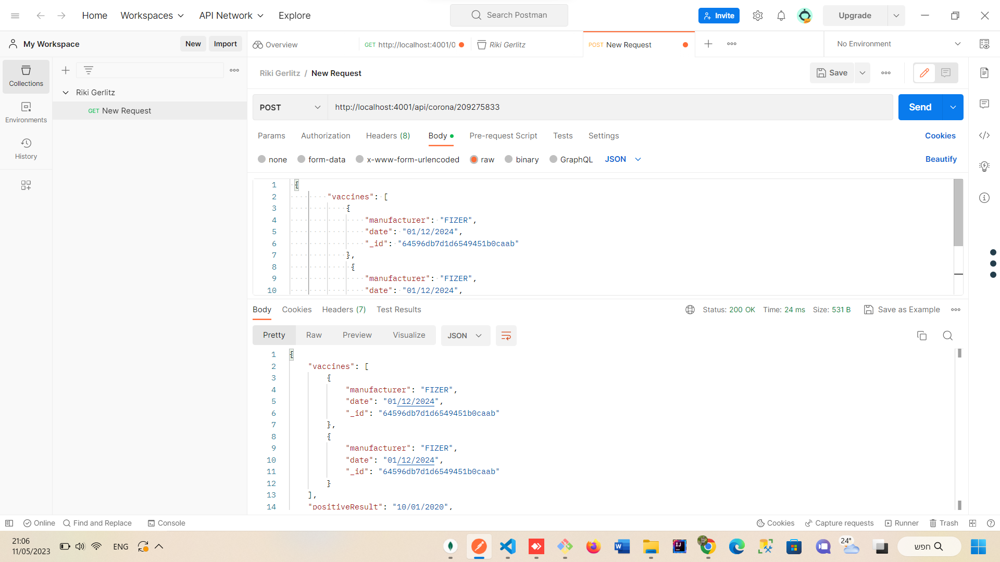

# Corona management system server 
# Riki Gerlitz

## אופן השימוש

הוספת אדם למערכת
```js
    http://localhost:4001/api/people
```
;

שליפת פרטי אדם
```js
    http://localhost:4001/api/people/209275833
```
;

שליפת פרטי אדם בקורונה
```js
http://localhost:4001/api/people/personFullDetails/209275833
```
;

שליפת כל האנשים
```js
http://localhost:4001/api/people
```
;

שליפת כל פרטי קורונה
```js
http://localhost:4001/api/corona
```
;

שליפת פרטי קורונה לאדם
```js
http://localhost:4001/api/corona/209275833
```
;

הוספת פרטי קורונה
```js
http://localhost:4001/api/corona/209275833
```
;


בשביל להתקין צריך להריץ בשורת הפקודה

```js
npm install --save
```

הותקנו במערכת
```js
npm i mongoose
```

```js
npm i dotenv
```

```js
npm i "body-parser"
```

```js
npm i express  
```